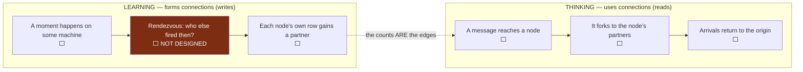
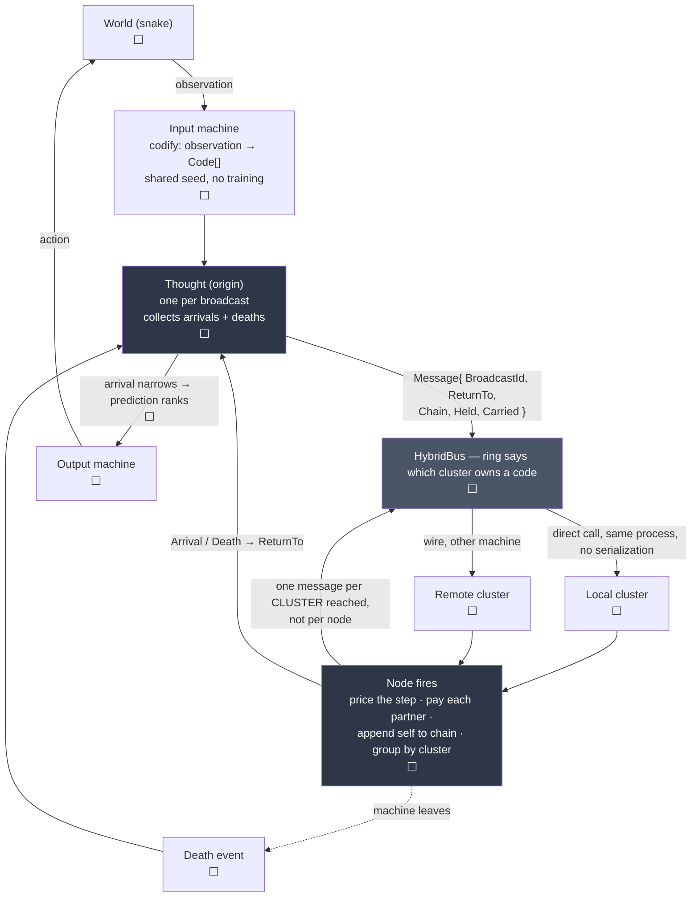

# Architecture

The living map. Updated as pieces land, so the shape is visible without
reading the code.

**Method-level detail lives in [design.md](design.md)** — what every piece is
and what every method does, in words.

**Current scope: snake, on one machine, every boundary shaped so the same code
runs across many.** Static background is out of scope — fork 1b.

**Status marks: ✅ built ⬜ proposed, not written 🔬 experiment we want to run**

**Everything in both diagrams below is now ✅ built and tested** — 122 tests,
49 mutations. The ⬜ marks inside them are stale and are kept only until the
next pass rewrites them; what is genuinely unbuilt is listed under **Open
forks**, and the diagrams' one real ⬜ is *prediction ranks*, which needs a
predictor that does not exist.

**A chain has caused a move.** 2 of 5 steps at seed 1, against 0 of 3 in the
blind control. That is the thing this whole design existed to make possible and
it had never happened before, on this branch or on `master`.

---

## The vocabulary

| Word | What it is |
|---|---|
| **Code** | A quantised fragment of one observation from one modality. Several codes fire for the same thing. **Never a concept** — a concept is what you reach by walking, and nobody holds one. |
| **Node** | One code, and its own row of counts. Holds edges, holds no address. |
| **Cluster** | A set of nodes. Holds an address. Fires exactly the node a message names. |
| **Machine** | Runs several clusters. The thing that joins and leaves the network. |
| **Message** | What crosses the bus. Two kinds — see below. |
| **Chain** | The nodes a message has walked, in order. The reasoning, carried. |

---

## Two kinds of traffic, and only one of them is designed

The Python has one process and one dictionary, so these are the same code path.
Distributed they are not, and conflating them is how the graph ends up with no
way to have been built.

**A connection is a count.** There is no edge object and no connect operation.
`_together[other]` going from absent to 1 *is* the connection forming. Nothing
decides that two nodes should be linked — decision 2, *every count, nothing
ever cut on the strength of a rule*.

### Two hashes, and they never meet

The easiest thing in this design to conflate. A time bucket is **not** a
cluster.

| | Hashed on | Answers | Lives for |
|---|---|---|---|
| **Time bucket** | the time window | who runs the rendezvous for this moment | one moment, then discarded |
| **Cluster** | the **code** | which machine holds this node, forever | the life of the network |

So **codes that fire together get connected to each other and then scatter**,
because placement is by *what a code is*, never by *when it arrived*. The
connection lives in the counts; the location lives in the ring. Independent.

**Nothing is assigned and nobody is told.** Every machine computes the owner of
a code independently from the code and the shared seed, and they all get the
same answer — decision 8, consistent hashing, no coordinator. A machine can
join a network it has never spoken to and route correctly immediately.

Buckets appear only on the learning path. The thinking loop never touches time.

### The stream is split by CHANGE, not by time

John, 2026-08-02. Input and output are continuous, and most things persist —
a thing here in one moment is usually still here in the next.

**Sampling a stream on a tick manufactures the distractor.** A code that stays
present gets counted every tick and co-occurs with everything that happens
while it is there, which is numerically enormous and means nothing. It is the
ever-present hub the `forward` weighting exists to refuse, created on purpose.

So a machine emits on **onset** and **offset**, never per tick. Persistence is
the absence of a message.

**The rule: on onset, a code joins with everything currently live, counted
once.** Not onset-with-onset — a sound starting while a ball is already visible
must connect, and that is the cross-modal binding the design exists for.

What it buys, none of it measured:

- **The window-width dial mostly dissolves.** The rendezvous becomes *did these
  intervals OVERLAP*, not *did these instants MATCH*. If a thing was visible
  two seconds, 50ms of clock skew is irrelevant. Overlap is robust against C2
  where coincidence is brittle.
- **Duration becomes representable** — decision 11's open ⬜. Offset minus
  onset, falling out of the encoding rather than needing a mechanism.
- **Order becomes real.** An occasion is currently a SET, so the graph cannot
  tell *A then B* from *A with B* anywhere. Onsets are ordered events, which
  gives `moments.Window`'s one-way write something honest to be directional
  about. Order alone measured 0.153 against 0.000 with the window off.
- **Traffic collapses.** A stable scene is silent.

**Named risk: a thing that never changes becomes invisible.** No onset, no
message, no count, no existence. Biology has this failure — a stabilised
retinal image fades — and answers it with microsaccades, which manufacture
change so the static world keeps reporting. We have no equivalent and no
decision that we do not need one.

### Continuous output downgrades termination

If input never stops, thoughts are continuously initiated and permanently
overlapping; there is no moment between thoughts. So the system acts on the
best chain arrived **so far**, and later arrivals refine it.

**Termination detection therefore drops from a correctness requirement to
housekeeping.** A thought stranded by a vanished machine leaks state instead of
hanging the system. Death events still release that state; they no longer
decide whether an answer is ever produced.

It also makes `BroadcastId` non-negotiable — there will always be many thoughts
in flight.

---

## The thinking loop

**Wire cost is distinct clusters reached, not nodes reached.** A node forking
to 200 partners across 12 clusters sends 12 messages. Hops inside a cluster are
method calls.

**What stops everything firing is not clustering — it is the edge weight.** A
code present on every occasion has every other code as a partner. Scoring a
partner by *how well it predicts you* gives it near zero, because it predicts
nothing in particular. Measured: 0.0000 for the distractor, 0.9800 for the real
link. Clusters are transport; fan-out control is the weighting.

---

## What each piece knows about the whole

| Piece | Holds | Knows about the whole |
|---|---|---|
| `Node` | one `Code`, its own row of counts | nothing |
| `Cluster` | the nodes it owns, its address | nothing |
| `Machine` | its clusters, its bus peers | its own peers only |
| `Thought` | one broadcast's arrivals and accounting | one thought |

**C1 check.** No box waits for every other box. The shared seed is a constant
handed out once and frozen, which C1 permits.

---

## Open forks

Recorded here so a decision does not go quiet.

1. **How a node learns who it fired with.** The rendezvous above. `master` has
   a C1-legal answer — `buckets.Join`: observations land in short time buckets,
   a bucket owner is computed locally by hash, the owner notices the
   coincidence and tells each participant its partners, then the bucket is
   discarded. Measured at **exactly 1.0 messages per observation**. Undecided
   whether to take that shape. **Onsets change what it has to do**: joining
   overlapping intervals is a different job from joining matched instants, and
   `Join` was built for the second.
   1b. **What manufactures change for a static world**, so a thing that never
   changes does not become invisible. **John's candidate, 2026-08-02: an input
   machine has a firing frequency** and re-asserts what it is sensing on that
   beat, whether or not anything changed. That is the microsaccade — change
   manufactured on purpose. It is *not* a return to tick-sampling as long as
   the beat is far slower than the frame rate: the background gets counted, but
   at a rate that does not swamp real events. **The beat is the dial and
   nothing has measured it.** Its risk is the one onsets exist to avoid — set
   it too fast and every persistent code becomes a hub again.
2. **Who computes the edge weight.** `forward` strength is
   `together(here, other) / seen(other)` — the *partner's* marginal, which the
   sender cannot know. Either the receiver weighs (message carries `together`,
   receiver divides by its own marginal — C1-legal by construction, but then
   the sender cannot price a step before sending it), or marginals gossip and
   go stale.
3. **Cluster placement.** 🔬 Uniform hash gives balance and no coordinator, and
   guarantees that codes which always fire together live far apart. Hashing on
   the **top k bits of the code** puts similar codes together, since LSH codes
   near in Hamming distance share prefixes — locality with no coordinator, and
   columns falling out of the addressing. Limit: within-modality only, because
   two front ends never share a prefix. An arm, not a default.
4. **Pricing under `cost: best`** needs every partner weight before any send.
6. **Broadcast to every cluster, or route by the ring? — John, 2026-08-02.**
   His proposal: put a message on the bus, let **every** cluster look at it and
   decide whether it holds a node that wants it. No ring, no address.
   **The distinction that decides it is origin versus hop.** An *origin* has no
   address by nature — *what is this thing I am sensing* cannot be routed,
   because you do not know what you are looking for, and that is the flood's
   whole advantage over targeted routing. A *hop* is the opposite: a route
   standing on a node knows exactly which partner it is walking to. That is an
   address, and routing it costs nothing.
   So the live question is narrower than it first looks: **broadcast the
   origin, route the hops** — currently both are routed. Broadcasting hops as
   well would multiply every message by the number of clusters, which is O(N)
   traffic per hop where the ring is O(1).
   **His locality observation is right and is available either way**: see fork
   3, where codes that live together are cheap to walk between without paying
   the broadcast cost.
   **John, 2026-08-02: "broadcast the origin, that's the initial input — yes."**
   Read as agreement with the origin/hop split; hops stay routed. Not built.

7. **How clusters are grouped — John's follow-up, 2026-08-02.**
   - **By modality: rejected by John, and he is right.** It puts a picture and
     a sound on different machines by construction, which is the one link the
     design exists to make.
   - **By code prefix** — fork 3. Similar codes land together. Data-free, no
     coordinator. Limit: within-modality only.
   - **By time of creation** — codes made in the same window share a cluster,
     so things that co-occur live together. **Breaks the property everything
     else rests on**: two machines seeing the same red ball at different times
     would compute different owners for the same code, and "every machine
     computes the same answer with nobody to ask" is gone. Recorded as ruled
     out unless something supplies placement agreement without a coordinator.

8. **How the flood is bounded — MEASURED, and the design's own answer failed.**
   The design says stamina is the whole of the schedule and no depth limit is
   needed, with `Best` pricing the one measured to bound the walk. **That holds
   only where edge weights DIFFER.** Under `Best` the price is the strongest
   partner's fuel, so a route down the best edge keeps its budget *exactly*. In
   a near-deterministic world almost every weight is near 1.0, every partner is
   the best partner, nothing decays, and the cycle check becomes the only
   bound — so the flood enumerates every simple path.

   Measured on a clique with equal weights, messages from one origin:

   | nodes | 4 | 5 | 6 | 7 | 8 |
   |---|---|---|---|---|---|
   | messages | 15 | 64 | 325 | 1,956 | 13,699 |

   A `Horizon` was added as a safety, required rather than defaulted, and every
   route it kills is counted as `Halted` — a walk that hit the horizon looks
   exactly like one that finished unless that is reported. **It is a constant
   nobody measured, which is the thing this project refuses everywhere else.**

   **And it is not enough.** A 200-step snake run at `Horizon = 6` on a graph of
   **13 nodes** halted **275,280** routes over 5 steps — roughly 55,000 route
   expansions per step. Factorial in the horizon. This does not scale to a real
   graph and something has to change.

   **SWEPT, 2026-08-02.** `Sweep` runs the arms that already exist. Routes
   halted at the horizon, 40-step budget, `Best` pricing, three seeds:

   | horizon | empty cells kept | | | empty cells withheld | | |
   |---|---|---|---|---|---|---|
   | | seed 1 | seed 2 | seed 3 | seed 1 | seed 2 | seed 3 |
   | 2 | 119 | 72 | 369 | 11 | 2 | 22 |
   | 3 | 971 | 504 | 1,543 | 21 | 0 | 247 |
   | 4 | 7,068 | 3,024 | 12,689 | 24 | 0 | 1,159 |
   | 5 | 46,536 | 15,120 | 96,612 | 6 | 0 | 5,118 |

   **Roughly sevenfold per extra hop**, which is the factorial growth showing
   up as a constant ratio. And **withholding empty cells is worth about four
   orders of magnitude** at horizon 5 on seed 1 — 46,536 against 6 — because it
   is the number of codes per frame that sets how dense the clique is. That arm
   already exists: `SnakeQuantizer(includeEmpty: false)`. **It still lets a
   chain cause a move**, which is asserted, because an arm that costs nothing
   by doing nothing is not a saving.

   **What the sweep cannot say.** Runs last 1–14 steps and **nothing ever ate a
   fruit** — across the whole grid, every arm, every seed. So this measures
   COST and says nothing whatever about whether the system plays well. Reading
   it as evidence of competence would be reading a number that is not there.

   **The root cause is that an occasion is a CLIQUE.** Every code in a frame is
   paired with every other, so ten codes a frame build a dense graph by
   construction, and a dense graph is what makes simple-path enumeration
   explode. Candidates, none measured: sparser occasions (pair only some of
   what co-occurs), a front end that produces fewer codes per moment, or
   something that makes weights differ so `Best` can bite again. **A beam is
   NOT a candidate** — capping how many partners are considered is already ❌
   on `master` as "a constant nobody set on purpose, doing the cutting".

10. **DOES THE CHAIN DO ANYTHING? Measured 2026-08-02.** 200 seeds, 300-step
    budget, `includeEmpty: false`, `Horizon = 4`. The graph learns identically
    under all three arms; only the choice differs.

    | policy | mean | sd | se | median | max | runs past 10 steps |
    |---|---|---|---|---|---|---|
    | chain | 6.575 | 5.772 | 0.408 | 4 | **39** | **62 / 200** |
    | random | 3.990 | 3.840 | 0.272 | 3 | 28 | 8 / 200 |
    | repeat the last action | 6.250 | 3.039 | 0.215 | **8** | 8 | 0 / 200 |

    **The chain beats random by about five standard errors** — a gap of 2.585
    against a combined error of 0.490. That one is real.

    **The chain and repeat-last-action are indistinguishable on the mean**:
    0.325 apart against a combined error of 0.461, which is under one standard
    error.

    **AN EARLIER READING OF THIS AT 30 SEEDS SAID THE CHAIN LOSES TO REPEAT
    (4.77 against 5.90) AND THAT WAS WRONG.** At 200 seeds the chain is
    nominally ahead and the difference is inside the noise either way. Recorded
    because the mistake is the instructive part: 30 seeds was not enough to
    support a comparison, and the number was published without a spread beside
    it.

    **The means are the wrong column.** The distributions barely overlap in
    shape. `repeat` is capped by geometry — a straight line from the centre of
    a 15-wide board hits the wall — so it never reaches 10 steps in 200 runs,
    and its median of 8 IS its maximum. The chain's median is worse at 4, and
    its tail is far longer: 62 of 200 runs past 10 steps, against repeat's 0,
    and a longest run of 39.

    **It is not merely echoing, though.** Of 77 chain-chosen moves over ten
    seeds, 28 repeated the last action — 36% against a chance rate of 25%. So
    the chain carries *some* momentum and nothing like all of it, which is what
    makes the comparison above meaningful rather than tautological.

    **Two things cut the other way and are not conclusions.** `repeat` is
    capped at 8 by geometry — walking straight from the centre of a 15-wide
    board hits the wall — so its mean is flattered by a task that is over
    before a straight line stops working. And the chain's best run reached 17,
    which no repeat run can. **Nothing ate a fruit under any policy**, so none
    of this is evidence about competence; it is evidence about survival in runs
    that end almost immediately.

    **The confound this replaced.** The `blind` arm changes two things — it
    stops the action joining the occasion, altering the graph, *and* forces
    every move to be random — so it can never say whether the chain helps.
    `Policy` exists to change one thing.

9. **Random play dies in about five steps**, because the four actions are
   absolute directions and reversing into the neck is instantly fatal. That is
   the floor everything gets compared against, so it needs to be understood
   before any number is read: a run that ends at step 5 has almost no
   experience in it.

11. **THE OUTPUT MACHINE IS NOT ADDRESSED — design and code diverge here.**
    The design says *a machine broadcasts an input carrying the id of the
    output machine it wants, so completed chains and death reports come back
    addressed*. **That is not built.** `Message.ReturnTo` is the address of the
    INPUT machine that started the thought; every arrival goes there, and the
    harness then hands the finished thought to an output machine by a direct
    call. So *arrival narrows* is real — the candidates are exactly the chains
    that reached that machine's codes — but the narrowing is a local filter,
    not routing. Nothing yet lets one broadcast name where it wants its answer
    delivered.

5. **What a thought does with a death event.**
    **John's answer, 2026-08-02, and it is the "carry the cluster back"
    option made precise.** A node knows which cluster it is in, so when it
    forks it reports not only how many routes it created but **which clusters
    it sent them into** — *2 into A, 3 into B, 1 into C*. The origin keeps a
    live count per cluster; when the bus fires a death for B, it subtracts B's
    count, and the thought's accounting closes instead of hanging.
    **Refinement: track where routes are GOING, not where they have BEEN.** A
    route that passed through a cluster and moved on is not stranded when that
    cluster dies, so the count must be decremented as each cluster reports.
    Cost is one address per outgoing route in a report. The bus fires one when a cluster
   leaves, at cluster granularity, because a route is stranded by the departure
   of whatever holds its next node. But **a thought does not track which
   clusters its routes are sitting in** — routes fan out and the origin only
   ever sees arrivals and counts. So on a death it cannot tell whether it was
   affected. Options, none measured: release every unsettled thought (loses
   live work), release none (leaks until something else decides), or have a
   route's cluster be reported back so a thought knows its own exposure (costs
   a field on every message). **This is the one thing the event bus was
   introduced to fix, so leaving it unanswered would defeat the point.**
