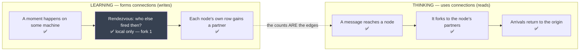
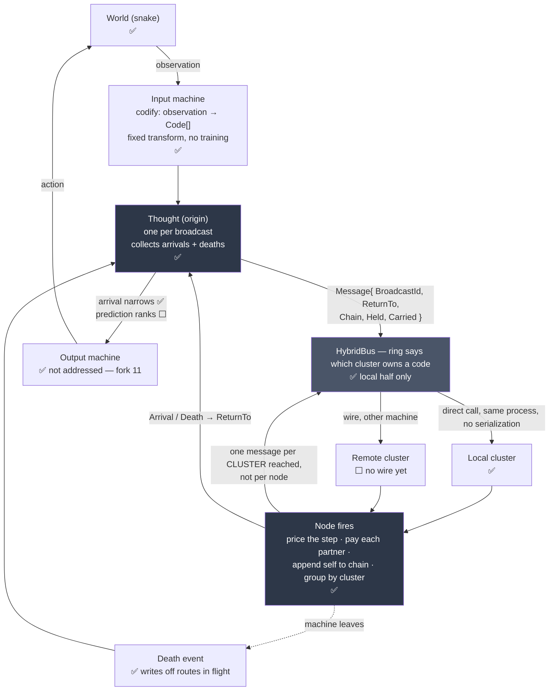

# Architecture

The living map. Updated as pieces land, so the shape is visible without
reading the code.

**Method-level detail lives in [design.md](design.md)** — what every piece is
and what every method does, in words. **It was rewritten against the code on
2026-08-02** after the refuted arms were deleted; before that it described a
system that no longer existed, which is the failure this pair of files exists to
prevent. Every public type in the source is named in it, checked rather than
assumed.

**Current scope: snake, on one machine, every boundary shaped so the same code
runs across many.** Static background is out of scope — fork 1b.

**Status marks: ✅ built ⬜ proposed, not written 🔬 experiment we want to run**

**A chain has caused a move.** Over 200 seeds it survives 6.575 steps against
random play's 3.990 — about five standard errors. That is the thing this design
existed to make possible and it had never happened before, on this branch or on
`master`. It does not yet beat repeating the last action, and nothing has ever
eaten a fruit; see fork 10.

**What is built, and what is not**, is now marked in the diagrams themselves
rather than described here. What is unbuilt or undecided lives under
**Open forks** at the bottom, which is the part kept current.

---

## The vocabulary

| Word | What it is |
|---|---|
| **Code** | A quantised fragment of one observation from one modality. Several codes fire for the same thing. **Never a concept** — a concept is what you reach by walking, and nobody holds one. |
| **Node** | One code, and its own row of counts. Holds edges, holds no address. |
| **Cluster** | A set of nodes. Holds an address. Fires exactly the node a message names. |
| **Machine** | Runs several clusters. The thing that joins and leaves the network. |
| **Message** | What crosses the bus. Two kinds — see below. |
| **Chain** | The nodes a message has walked, in order. The reasoning, carried. |

---

## Two kinds of traffic, and only one of them is designed

The Python has one process and one dictionary, so these are the same code path.
Distributed they are not, and conflating them is how the graph ends up with no
way to have been built.

**A connection is a count.** There is no edge object and no connect operation.
`_together[other]` going from absent to 1 *is* the connection forming. Nothing
decides that two nodes should be linked — decision 2, *every count, nothing
ever cut on the strength of a rule*.

### Two hashes, and they never meet

The easiest thing in this design to conflate. A time bucket is **not** a
cluster.

| | Hashed on | Answers | Lives for |
|---|---|---|---|
| **Time bucket** | the time window | who runs the rendezvous for this moment | one moment, then discarded |
| **Cluster** | the **code** | which machine holds this node, forever | the life of the network |

So **codes that fire together get connected to each other and then scatter**,
because placement is by *what a code is*, never by *when it arrived*. The
connection lives in the counts; the location lives in the ring. Independent.

**Nothing is assigned and nobody is told.** Every machine computes the owner of
a code independently from the code and the shared seed, and they all get the
same answer — decision 8, consistent hashing, no coordinator. A machine can
join a network it has never spoken to and route correctly immediately.

Buckets appear only on the learning path. The thinking loop never touches time.

### The stream is split by CHANGE, not by time

John, 2026-08-02. Input and output are continuous, and most things persist —
a thing here in one moment is usually still here in the next.

**Sampling a stream on a tick manufactures the distractor.** A code that stays
present gets counted every tick and co-occurs with everything that happens
while it is there, which is numerically enormous and means nothing. It is the
ever-present hub the `forward` weighting exists to refuse, created on purpose.

So a machine emits on **onset** and **offset**, never per tick. Persistence is
the absence of a message.

**The rule: on onset, a code joins with everything currently live, counted
once.** Not onset-with-onset — a sound starting while a ball is already visible
must connect, and that is the cross-modal binding the design exists for.

What it buys, none of it measured:

- **The window-width dial mostly dissolves.** The rendezvous becomes *did these
  intervals OVERLAP*, not *did these instants MATCH*. If a thing was visible
  two seconds, 50ms of clock skew is irrelevant. Overlap is robust against C2
  where coincidence is brittle.
- **Duration becomes representable** — decision 11's open ⬜. Offset minus
  onset, falling out of the encoding rather than needing a mechanism.
- **Order becomes real.** An occasion is currently a SET, so the graph cannot
  tell *A then B* from *A with B* anywhere. Onsets are ordered events, which
  gives `moments.Window`'s one-way write something honest to be directional
  about. Order alone measured 0.153 against 0.000 with the window off.
- **Traffic collapses.** A stable scene is silent.

**Named risk: a thing that never changes becomes invisible.** No onset, no
message, no count, no existence. Biology has this failure — a stabilised
retinal image fades — and answers it with microsaccades, which manufacture
change so the static world keeps reporting. We have no equivalent and no
decision that we do not need one.

### Continuous output downgrades termination

If input never stops, thoughts are continuously initiated and permanently
overlapping; there is no moment between thoughts. So the system acts on the
best chain arrived **so far**, and later arrivals refine it.

**Termination detection therefore drops from a correctness requirement to
housekeeping.** A thought stranded by a vanished machine leaks state instead of
hanging the system. Death events still release that state; they no longer
decide whether an answer is ever produced.

It also makes `BroadcastId` non-negotiable — there will always be many thoughts
in flight.

---

## The thinking loop

**Wire cost is distinct clusters reached, not nodes reached.** A node forking
to 200 partners across 12 clusters sends 12 messages. Hops inside a cluster are
method calls.

**What stops everything firing is not clustering — it is the edge weight.** A
code present on every occasion has every other code as a partner. Scoring a
partner by *how well it predicts you* gives it near zero, because it predicts
nothing in particular. Measured: 0.0000 for the distractor, 0.9800 for the real
link. Clusters are transport; fan-out control is the weighting.

---

## What each piece knows about the whole

| Piece | Holds | Knows about the whole |
|---|---|---|
| `Node` | one `Code`, its own row of counts | nothing |
| `Cluster` | the nodes it owns, its address | nothing |
| `Machine` | its clusters, its bus peers | its own peers only |
| `Thought` | one broadcast's arrivals and accounting | one thought |

**C1 check.** No box waits for every other box. The shared seed is a constant
handed out once and frozen, which C1 permits.

---

## What was deleted, and why deleting it was the point

**John's rule, 2026-08-02: a decided option kept around as a control sneaks back
in and causes havoc later.** So the refuted arms are gone from the code rather
than parked in it. Their measurements stay here; the code does not.

| Deleted | Measured against it |
|---|---|
| `StepCost.Best` / `Local` / `Constant` | `Best` was factorial where inverse is polynomial — 5,000,003 messages against 1,111 on a 12-clique |
| `Refuel` | Nothing is paid back under inverse cost, so it did nothing |
| `Charge` | The price for `Constant`, which is gone |
| `Weighing.Sender`, `IMarginals`, `LocalMarginals` | The C1 violation the receiver arm exists to remove. **`Node.Fire` now takes only the message** — there is no longer a way to hand a node another node's data |
| The unrotated view and absolute actions | 6.5 mean steps against 51.3, and one move in four was instantly fatal |
| `includeEmpty: true` | 46,536 routes halted against 6 |

**The energy sweep, 100 seeds a cell** — `Chain:steps/fruit`:

| energy | food | chain | random | repeat | longest | most fruit |
|---|---|---|---|---|---|---|
| 20 | 30 | 20/3 | 19/5 | 16/1 | chain | random |
| 40 | 30 | 37/8 | 30/10 | 30/1 | chain | random |
| 80 | 30 | 64/12 | 37/13 | 57/1 | chain | random |
| 80 | 100 | 62/14 | 37/13 | 57/1 | **chain** | **chain** |
| 200 | 30 | 96/17 | 38/13 | **139**/1 | repeat | chain |

**Lowering the energy does kill the circling artefact** — repeat only wins
survival at 200 energy, and at 80 or below the chain outlives it. **But it does
not make eating and surviving the same thing**: random still takes more fruit
per step alive at most settings. Only `energy 80, food 100` has the chain
winning both, and by one fruit.

---

## Open forks

Recorded here so a decision does not go quiet.

**They are not in numerical order and are deliberately NOT renumbered** — the
code cites fork numbers in a dozen places, and renumbering would strand every
one of them. That ghost-reference problem has bitten this project before. This
index is the fix instead: it says where each one stands, so the file can be read
by status rather than by scrolling.

**Waiting on a decision — nothing can proceed without these**

| | | |
|---|---|---|
| **19** | ✅ Prediction built — and it loses to a blind guess, because the graph holds **no temporal edges**. Next mechanism named: a one-way window |
| **18** | **What to score.** Survival is disqualified: the arm that survives longest is the one that circles and eats nothing | **blocks 15 and 16** |
| **15** | Strengthening a connection a thought walks | gated on 18 — it would be tuned against whatever we score |
| **16** | Back-propagation from an outside signal | gated on 18, same reason |
| **11** | The output machine is not addressed | needed before a second machine |
| **12** | `Halted` is approximate, and the ordering that causes it | both orderings cost something |

**Open, but nothing is blocked on them**

| | |
|---|---|
| **1** | The distributed rendezvous — not needed until a second machine exists |
| **1b** | What manufactures change for a static world — John's heartbeat is the only candidate |
| **3** | Cluster placement: uniform hash against prefix locality |
| **7** | How clusters are grouped — modality and time-of-creation both ruled out |
| **17** | Forgetting — designed on `master`, unbuilt here |

**Settled**

| | |
|---|---|
| **2** | ✅ Receiver weighs, and it is the default |
| **5** | ✅ A death writes off exactly the routes heading into the dead cluster |
| **6** | ✅ Broadcast the origin, route the hops |
| **8** | ✅ Answered by 14 — factorial became polynomial in the budget |
| **9** | ✅ Answered by relative inputs — reversing is no longer an action |
| **13** | ✅ The in-flight accounting was wrong on 39% of thoughts; the clamp was the bug |
| **14** | ✅ Inverse cost, `1/weight`. Answered 8 as a side effect and unblocked 2 |
| **4** | Folded into **14**, which is the same question asked properly |

**Measured findings, not decisions**

| | |
|---|---|
| **10** | The chain outlives random by ~12 standard errors and takes more fruit; it loses survival to circling, and random eats more per step alive |

---

Recorded here so a decision does not go quiet.

1. **How a node learns who it fired with.** The rendezvous above. `master` has
   a C1-legal answer — `buckets.Join`: observations land in short time buckets,
   a bucket owner is computed locally by hash, the owner notices the
   coincidence and tells each participant its partners, then the bucket is
   discarded. Measured at **exactly 1.0 messages per observation**. Undecided
   whether to take that shape. **Onsets change what it has to do**: joining
   overlapping intervals is a different job from joining matched instants, and
   `Join` was built for the second.
   1b. **What manufactures change for a static world**, so a thing that never
   changes does not become invisible. **John's candidate, 2026-08-02: an input
   machine has a firing frequency** and re-asserts what it is sensing on that
   beat, whether or not anything changed. That is the microsaccade — change
   manufactured on purpose. It is *not* a return to tick-sampling as long as
   the beat is far slower than the frame rate: the background gets counted, but
   at a rate that does not swamp real events. **The beat is the dial and
   nothing has measured it.** Its risk is the one onsets exist to avoid — set
   it too fast and every persistent code becomes a hub again.
2. **✅ BUILT, 2026-08-02 — the receiver weighs, and it is the default.** The
   sender owns `together(me, you)` and puts that number in the message; the
   receiver divides by `seen(me)`, its own marginal. **Neither node ever reads
   the other's data**, so nothing is fetched, gossiped or cached — asserted by
   handing the receiver arm an `IMarginals` that throws if anything asks it.

   **Fork 14 is what unblocked it.** While a step was priced at the sending
   node's strongest edge, the sender had to know every partner's weight before
   it could send anything. Under inverse cost the price belongs to the edge, so
   the receiver charges for the hop it just took.

   **Measured, 100 seeds:** behaviour is indistinguishable — 88.87 mean steps
   against the sender arm's 95.12, either side of a standard error of about
   5.5 — and it costs **26.7 messages a step against 17.0**. Half again as
   many, which is the price of removing the C1 violation and is not the
   blow-up it might have been.

   **The sender can still prune exactly once**, needing nothing from anyone: a
   weight cannot exceed 1.0, so no hop costs less than 1, so a budget of 1 or
   less cannot afford any partner at all.

   **`StepCost` is refused under it rather than ignored.** A receiver prices at
   `1/weight` on arrival and a sender has no weights, so `Best` and `Local` are
   unreachable from there — and an argument that silently does nothing is a
   sweep arm that looks distinct and is not.

   **`IMarginals` and `LocalMarginals` survive only for the sender arm**, which
   exists to price the comparison above. When that arm goes, they go.

   *Original statement of the fork:* `forward` strength is
   `together(here, other) / seen(other)` — the *partner's* marginal, which the
   sender cannot know. Either the receiver weighs (message carries `together`,
   receiver divides by its own marginal — C1-legal by construction, but then
   the sender cannot price a step before sending it), or marginals gossip and
   go stale.
3. **Cluster placement.** 🔬 Uniform hash gives balance and no coordinator, and
   guarantees that codes which always fire together live far apart. Hashing on
   the **top k bits of the code** puts similar codes together, since LSH codes
   near in Hamming distance share prefixes — locality with no coordinator, and
   columns falling out of the addressing. Limit: within-modality only, because
   two front ends never share a prefix. An arm, not a default.
4. **Pricing under `cost: best`** needs every partner weight before any send.
   **Folded into fork 14**, which asks the same thing with the measurements
   behind it. Kept as a number because deleting one would renumber the rest.
6. **Broadcast to every cluster, or route by the ring? — John, 2026-08-02.**
   His proposal: put a message on the bus, let **every** cluster look at it and
   decide whether it holds a node that wants it. No ring, no address.
   **The distinction that decides it is origin versus hop.** An *origin* has no
   address by nature — *what is this thing I am sensing* cannot be routed,
   because you do not know what you are looking for, and that is the flood's
   whole advantage over targeted routing. A *hop* is the opposite: a route
   standing on a node knows exactly which partner it is walking to. That is an
   address, and routing it costs nothing.
   So the live question is narrower than it first looks: **broadcast the
   origin, route the hops** — currently both are routed. Broadcasting hops as
   well would multiply every message by the number of clusters, which is O(N)
   traffic per hop where the ring is O(1).
   **His locality observation is right and is available either way**: see fork
   3, where codes that live together are cheap to walk between without paying
   the broadcast cost.
   **John, 2026-08-02: "broadcast the origin, that's the initial input — yes."**
   Read as agreement with the origin/hop split; hops stay routed. Not built.

7. **How clusters are grouped — John's follow-up, 2026-08-02.**
   - **By modality: rejected by John, and he is right.** It puts a picture and
     a sound on different machines by construction, which is the one link the
     design exists to make.
   - **By code prefix** — fork 3. Similar codes land together. Data-free, no
     coordinator. Limit: within-modality only.
   - **By time of creation** — codes made in the same window share a cluster,
     so things that co-occur live together. **Breaks the property everything
     else rests on**: two machines seeing the same red ball at different times
     would compute different owners for the same code, and "every machine
     computes the same answer with nobody to ask" is gone. Recorded as ruled
     out unless something supplies placement agreement without a coordinator.

8. **How the flood is bounded — MEASURED, and the design's own answer failed.**
   The design says stamina is the whole of the schedule and no depth limit is
   needed, with `Best` pricing the one measured to bound the walk. **That holds
   only where edge weights DIFFER.** Under `Best` the price is the strongest
   partner's fuel, so a route down the best edge keeps its budget *exactly*. In
   a near-deterministic world almost every weight is near 1.0, every partner is
   the best partner, nothing decays, and the cycle check becomes the only
   bound — so the flood enumerates every simple path.

   Measured on a clique with equal weights, messages from one origin:

   | nodes | 4 | 5 | 6 | 7 | 8 |
   |---|---|---|---|---|---|
   | messages | 15 | 64 | 325 | 1,956 | 13,699 |

   A `Horizon` was added as a safety, required rather than defaulted, and every
   route it kills is counted as `Halted` — a walk that hit the horizon looks
   exactly like one that finished unless that is reported. **It is a constant
   nobody measured, which is the thing this project refuses everywhere else.**

   **And it is not enough.** A 200-step snake run at `Horizon = 6` on a graph of
   **13 nodes** halted **275,280** routes over 5 steps — roughly 55,000 route
   expansions per step. Factorial in the horizon. This does not scale to a real
   graph and something has to change.

   **SWEPT, 2026-08-02.** `Sweep` runs the arms that already exist. Routes
   halted at the horizon, 40-step budget, `Best` pricing, three seeds:

   | horizon | empty cells kept | | | empty cells withheld | | |
   |---|---|---|---|---|---|---|
   | | seed 1 | seed 2 | seed 3 | seed 1 | seed 2 | seed 3 |
   | 2 | 119 | 72 | 369 | 11 | 2 | 22 |
   | 3 | 971 | 504 | 1,543 | 21 | 0 | 247 |
   | 4 | 7,068 | 3,024 | 12,689 | 24 | 0 | 1,159 |
   | 5 | 46,536 | 15,120 | 96,612 | 6 | 0 | 5,118 |

   **Roughly sevenfold per extra hop**, which is the factorial growth showing
   up as a constant ratio. And **withholding empty cells is worth about four
   orders of magnitude** at horizon 5 on seed 1 — 46,536 against 6 — because it
   is the number of codes per frame that sets how dense the clique is. That arm
   already exists: `SnakeQuantizer(includeEmpty: false)`. **It still lets a
   chain cause a move**, which is asserted, because an arm that costs nothing
   by doing nothing is not a saving.

   **What the sweep cannot say.** Runs last 1–14 steps and **nothing ever ate a
   fruit** — across the whole grid, every arm, every seed. So this measures
   COST and says nothing whatever about whether the system plays well. Reading
   it as evidence of competence would be reading a number that is not there.

   **✅ JOHN'S CALL, 2026-08-02: withhold empty cells, and it is now the
   default.** The whole test suite went from 15 seconds to 1 on that change
   alone, which is the four orders of magnitude showing up as wall clock.
   It does not make the flood scale — it makes the graph smaller. The
   factorial is still there.

   **The root cause is that an occasion is a CLIQUE.** Every code in a frame is
   paired with every other, so ten codes a frame build a dense graph by
   construction, and a dense graph is what makes simple-path enumeration
   explode. Candidates, none measured: sparser occasions (pair only some of
   what co-occurs), a front end that produces fewer codes per moment, or
   something that makes weights differ so `Best` can bite again. **A beam is
   NOT a candidate** — capping how many partners are considered is already ❌
   on `master` as "a constant nobody set on purpose, doing the cutting".

10. **DOES THE CHAIN DO ANYTHING? Re-measured 2026-08-02 on the relative arm,
    where runs are long enough to ask.** 200 seeds, inverse cost, horizon 50,
    1,000-step budget. `starved` means the energy ran out; `collided` means it
    hit something.

    | energy | policy | mean | se | max | starved | collided | fruit |
    |---|---|---|---|---|---|---|---|
    | 60 | chain | 51.05 | 1.01 | **60** | 124 | 76 | 15 |
    | 60 | random | 33.70 | 1.15 | 77 | 25 | 175 | 22 |
    | 60 | repeat | 42.01 | 1.76 | **60** | 131 | 69 | 2 |
    | 200 | chain | 92.85 | 4.06 | 209 | 18 | 182 | **40** |
    | 200 | random | 37.41 | 1.76 | 142 | 0 | 200 | 25 |
    | 200 | **repeat** | **133.71** | 6.47 | 200 | 131 | 69 | **2** |

    **At 60 energy the chain and repeat arms were censored** — their maxima are
    exactly the starting energy, so those runs ended at the cap rather than in
    the world and no mean taken there measured anything. Everything below is
    read off the 200-energy rows.

    **SURVIVAL IS THE WRONG METRIC, and this is the finding.** Repeating a turn
    under relative actions is a tight circle the snake can hold forever, so it
    outlives every other arm — 133.71 against the chain's 92.85, about five
    standard errors — and eats **two** fruit in 200 runs against the chain's
    forty. The arm that survives longest is the one that achieves least.

    **What the chain does have:** it outlives random by about twelve standard
    errors, and it eats more than either other arm in absolute terms.

    **What it does not:** per step alive, random eats MORE — 0.0033 fruit per
    step against the chain's 0.0022. So the chain buys survival, not appetite.

    **And its behaviour is mostly momentum.** 5,865 of 7,692 chain-chosen moves
    repeated the last action — **76%**, against 33% by chance over three turns.
    Under absolute actions that figure was 36%. So on this arm the chain is
    behaving like a noisy version of the arm that beats it.

    **No arm dominates**, and the honest next question is what to score. Fruit
    per step alive is the only column so far that is not won by standing still. 200 seeds, 300-step budget, `Horizon = 4`, empty cells
    withheld. The graph learns identically under all three arms; only the
    choice differs.

    | policy | mean | sd | se | median | max | past 10 steps | fruit |
    |---|---|---|---|---|---|---|---|
    | chain | 6.705 | 5.970 | 0.422 | 4 | **39** | **64 / 200** | **7** |
    | random | 3.990 | 3.840 | 0.272 | 3 | 28 | 8 / 200 | 0 |
    | repeat the last action | 6.250 | 3.039 | 0.215 | **8** | 8 | 0 / 200 | 3 |

    **SOMETHING HAS EATEN A FRUIT.** Every previous entry here said nothing ever
    had, and that was **a sample-size artefact**: it was measured at 30 seeds
    and fruit turns out to happen about seven times in 200 runs. **No claim is
    made that the broadcast caused it** — the old code has not been re-run at
    200 seeds, so the honest statement is only that the earlier zero was too
    small a sample to support.

    Seven against three against zero is far too few to separate the arms. What
    it does retire is the flat statement that nothing has ever eaten.

    **The chain beats random by about six standard errors** — a gap of 2.715
    against a combined error of 0.502. That one is real and has survived every
    re-measurement.

    **The chain and repeat-last-action are indistinguishable on the mean**:
    0.455 apart against a combined error of 0.474, which is under one standard
    error.

    **AN EARLIER READING OF THIS AT 30 SEEDS SAID THE CHAIN LOSES TO REPEAT
    (4.77 against 5.90) AND THAT WAS WRONG.** At 200 seeds the chain is
    nominally ahead and the difference is inside the noise either way. Recorded
    because the mistake is the instructive part: 30 seeds was not enough to
    support a comparison, and the number was published without a spread beside
    it.

    **The means are the wrong column.** The distributions barely overlap in
    shape. `repeat` is capped by geometry — a straight line from the centre of
    a 15-wide board hits the wall — so it never reaches 10 steps in 200 runs,
    and its median of 8 IS its maximum. The chain's median is worse at 4, and
    its tail is far longer: 62 of 200 runs past 10 steps, against repeat's 0,
    and a longest run of 39.

    **It is not merely echoing, though.** Of 77 chain-chosen moves over ten
    seeds, 28 repeated the last action — 36% against a chance rate of 25%. So
    the chain carries *some* momentum and nothing like all of it, which is what
    makes the comparison above meaningful rather than tautological.

    **Two things cut the other way and are not conclusions.** `repeat` is
    capped at 8 by geometry — walking straight from the centre of a 15-wide
    board hits the wall — so its mean is flattered by a task that is over
    before a straight line stops working. And the chain's best run reached 17,
    which no repeat run can. **Nothing ate a fruit under any policy**, so none
    of this is evidence about competence; it is evidence about survival in runs
    that end almost immediately.

    **The confound this replaced.** The `blind` arm changes two things — it
    stops the action joining the occasion, altering the graph, *and* forces
    every move to be random — so it can never say whether the chain helps.
    `Policy` exists to change one thing.

9. **✅ ANSWERED BY RELATIVE INPUTS, 2026-08-02.** Random play died in about
   five steps because the four actions were absolute directions and reversing
   into the neck is instantly fatal — one move in four killed the snake at
   once. **The view now rotates with the snake's heading and actions become
   Ahead / Left / Right, so Back is not an action that exists.** It falls out
   of the coordinate system rather than being a rule bolted on.

   **Measured, 200 seeds, inverse cost, horizon 50:**

   | arm | policy | mean steps | se | past 20 steps | fruit |
   |---|---|---|---|---|---|
   | absolute | chain | 6.530 | 0.416 | 2 / 200 | 9 |
   | absolute | random | 3.990 | 0.272 | 3 / 200 | 0 |
   | **relative** | **chain** | **51.260** | 1.009 | **189 / 200** | 18 |
   | **relative** | random | 33.705 | 1.153 | 145 / 200 | 22 |

   **Runs are about eight times longer**, and the recurrence the rotation was
   supposed to buy shows up too: new nodes per step fall from **0.98 to 0.19**,
   so a code is seen about five times as often before a run ends.

   **Two cautions before anyone reads the chain column as a result.** The chain
   arm's maximum is 60, which is exactly the starting energy — those runs are
   **censored by the energy cap**, not by dying, so 51.260 is a lower bound.
   And random ate *more* fruit than the chain did (22 against 18), so surviving
   longer and eating are not the same thing here. Fork 10 gets re-measured on
   this arm as its own step.

11. **THE OUTPUT MACHINE IS NOT ADDRESSED — design and code diverge here.**
    The design says *a machine broadcasts an input carrying the id of the
    output machine it wants, so completed chains and death reports come back
    addressed*. **That is not built.** `Message.ReturnTo` is the address of the
    INPUT machine that started the thought; every arrival goes there, and the
    harness then hands the finished thought to an output machine by a direct
    call. So *arrival narrows* is real — the candidates are exactly the chains
    that reached that machine's codes — but the narrowing is a local filter,
    not routing. Nothing yet lets one broadcast name where it wants its answer
    delivered.

5. **What a thought does with a death event. ✅ BUILT — John's answer,
    2026-08-02, and it is the "carry the cluster back" option made precise.** A node knows which cluster it is in, so when it
    forks it reports not only how many routes it created but **which clusters
    it sent them into** — *2 into A, 3 into B, 1 into C*. The origin keeps a
    live count per cluster; when the bus fires a death for B, it subtracts B's
    count, and the thought's accounting closes instead of hanging.
    **Refinement: track where routes are GOING, not where they have BEEN.** A
    route that passed through a cluster and moved on is not stranded when that
    cluster dies, so the count must be decremented as each cluster reports.
    Cost is one address per outgoing route in a report.
    **Built and measured**: a thought now tracks routes in flight per cluster,
    a departure writes off exactly those and counts them as deaths, and a
    thought whose every cluster leaves settles instead of waiting. A cluster
    the thought never routed into strands nothing, which is asserted.
    **Side effect worth having: `Balanced()` stopped being a tautology.** The
    live count comes from splits and deaths; the in-flight counts come from the
    routing named in each report. Those are two independent quantities, and
    them agreeing is a real check where the old one held by construction.

19. **PREDICTION IS BUILT AND IT PREDICTS WORSE THAN GUESSING. Measured
    2026-08-02, and the diagnosis is the useful part.**

    **John's constraint, and it decides the design:** the goal is understanding,
    not prediction. Not *what is the most likely next thing* — a sequence model,
    which cannot be asked a counterfactual — but *what would the world look like
    if I did X*. So the question carries a candidate action in it.

    **It needed no new mechanism.** The flood already works out what is
    associated with a set of codes. Broadcast the current view **plus the chosen
    action** and narrow the arrivals to **sensory** codes rather than the output
    machine's — `Thought.BestOf(modality, n)`, the same narrowing that already
    does output selection, pointed at a sense. Scored prequentially: the guess
    is settled against the next observation before anything is counted.

    **The result, 100 seeds a cell**, precision being the share of named codes
    that turned up:

    | energy | questions | foresaw | precision | blind |
    |---|---|---|---|---|
    | 80 | 6,067 | 0.905 | 0.584 | **0.647** |
    | 200 | 9,165 | 0.845 | 0.548 | **0.621** |

    **A blind draw from the same alphabet beats it, at both settings.** Not a
    small margin and not a wash.

    **AND THE REASON IS STRUCTURAL: THE GRAPH HOLDS NO TEMPORAL EDGES AT ALL.**
    The rendezvous joins an onset with what was live **in the same occasion**,
    so every edge is within-moment. Nothing links moment *t* to moment *t+1*.
    The graph is being asked what comes next by a structure that has only ever
    recorded what happens *together*. `master` measured exactly this and named
    the control: **0.153 with a window on against 0.000 with it off, "the
    control being that no temporal edge means no candidate to offer"**. What
    little is scored here comes from codes that persist across frames, not from
    anything the graph knows about succession.

    **So the next mechanism is named rather than guessed at**: `moments.Window`
    — a window that carries recent moments forward, **written one way**. The
    storage is already directional (`Observe` writes one row where a pair writes
    both), so time costs no new storage, only a decision about which direction
    to write.

    **Conditioning shows up as rank, not exclusion**, which is the mechanism
    rather than a shortfall in it. Asked with `Left`, the graph ranks what
    `Left` leads to above what `Right` leads to — but it reaches both, because
    the state alone has co-occurred with each. A broadcast expresses preference
    as economics, not as selection.

    **THE MEASUREMENT WAS WRONG, NOT THE MECHANISM — corrected 2026-08-02.**
    Predicting the whole next observation is mostly predicting **persistence**,
    which is free: most codes are still there next frame whatever anyone does,
    and a blind draw from a small alphabet is very good at "the same again". On
    that measure the graph scores 0.58 against a blind 0.64 and looks worse than
    chance.

    **Scored against what actually STARTED, the graph wins.** Per seed over 150
    seeds, precision on onsets minus the blind draw's:

    | span | gap | se | sigma |
    |---|---|---|---|
    | 0 | 0.0094 | 0.0015 | **6.3** |
    | 2 | 0.0130 | 0.0018 | 7.3 |
    | 4 | 0.0104 | 0.0018 | 5.9 |
    | 8 | 0.0121 | 0.0019 | 6.3 |

    **This is the first positive result in the project that is not about
    survival.** The graph knows something about what is coming.

    **AND THE WINDOW DOES NOT MEASURABLY HELP.** Span 0 — no temporal edges at
    all — already achieves it, and the differences between spans are inside a
    standard error and a half of each other. An earlier reading off aggregated
    totals suggested the gap grew with span; **the per-seed spread says that was
    noise**, which is the second time a bare mean has misled here.

    **So simultaneity alone carries the predictive signal in this world**: a
    code that has co-occurred with what is present tends to turn up next, and
    explicit succession adds nothing on top of that. `master` measured the
    opposite on its senses graph — 0.153 with a window against 0.000 without —
    so this null is **conditional on snake**, where almost everything visible
    persists frame to frame. The window is kept at span 0 by default rather than
    deleted, because a refutation is conditional on its configuration and this
    one has only met one world.

    **A mutation survives here and is recorded rather than hidden:** removing
    the action from `SnakeRun`'s prediction broadcast does not turn any test
    red. The counterfactual is asserted at the `Thought` level, where two
    actions over one state produce different rankings; the run's *wiring* of
    that is not separately observable from outside.

18. **WHAT TO SCORE — open, and it blocks the two feedback forks.**
    Survival is disqualified: repeating one turn is a circle the snake holds
    forever, so it outlives every other arm and eats **two** fruit in 200 runs
    against the chain's forty. **The arm that survives longest is the one that
    achieves least.**
    Lowering the energy kills the circling artefact — at 80 energy or below the
    chain outlives repeat — but it does **not** make eating and surviving the
    same thing: random still takes more fruit per step alive at most settings.
    Candidates, none chosen: **fruit per step alive** (the only column so far
    not won by standing still); **fruit outright** (honest but rare); something
    that penalises circling directly (which risks scoring the mechanism rather
    than the outcome).
    **Forks 15 and 16 wait on this**, because a feedback loop tuned against the
    wrong score is worse than no feedback loop.

15. **STRENGTHENING ON USE — John, 2026-08-02.** A connection a thought walks
    gets stronger; one a thought cannot continue down gets weaker. **Not
    happening today: thinking is entirely read-only and only the rendezvous
    writes.**
    **The trap, and it is the reason to be careful rather than not to do it.**
    `together / seen` currently estimates how often two codes actually
    co-occurred. If use also increments it, the number stops estimating
    anything about the world, the system's own behaviour becomes
    indistinguishable from evidence, and every measurement built on it becomes
    unreadable. It is also rich-get-richer: strong → walked → stronger,
    which can collapse the graph into a few dominant paths regardless of the
    world.
    **Proposed resolution: keep TWO numbers.** `together` stays pure
    observation; a separate `use` count feeds the COST but not the WEIGHT. The
    reinforcement is real, the evidence is untouched, and whether use-based
    cost helps becomes measurable against the observational number.

16. **BACK-PROPAGATION — John, 2026-08-02.** Reinforce the chain that was
    finally chosen.
    **Objection: reinforcing a chain because it was chosen adds no
    information.** It was chosen for being strongest; making it stronger is a
    loop with no input, which is rich-get-richer with extra steps.
    **It becomes real the moment the signal comes from OUTSIDE.** There is
    exactly one honest external signal here — energy. Reinforce the chain that
    preceded a fruit, not the chain that won the ranking. Nothing declares food
    good; energy runs out if you do not eat, so survival does the declaring.
    That would be the first credit assignment in this project rather than
    bookkeeping.

17. **FORGETTING — John, 2026-08-02**, and designed on `master` but unbuilt
    here: `CoOccurrence(half_life)`, aged on read rather than swept, clocked on
    **the node's own occasions** so a node nobody talks to does not forget
    because the rest of the world got busy.

14. **WHAT DOES A STEP COST, once the sender cannot weigh? — John's question,
    2026-08-02, and his answer is better than the question.** He proposed that
    a hop should cost the weight of the edge it walks rather than a flat charge
    for leaving the node, and then sharpened it to an **INVERSE** cost: the
    stronger the connection, the cheaper the step, so a route runs further down
    strong edges than weak ones.

    **He is wrong that `Best` penalises the best edge** — the price is the max
    but the payment is the taken edge, so the best breaks even exactly.
    **He is right about something better than what he said**: under `Best` the
    cost of taking edge X depends on what OTHER edges that node happens to
    have. Add a stronger sibling and X costs more, though nothing about X
    changed. Cost should be a property of the connection alone.

    **AND HIS FORM FIXES FORK 8.** Under `Best` a route down the best edge pays
    exactly zero net, so in a near-deterministic world where nearly every
    weight is near 1.0 nothing ever decays and only the cycle check bounds the
    walk — which is the measured factorial. Under a strictly positive cost
    every hop costs something, so the walk is **bounded by construction** and
    the `Horizon` constant stops being needed.

    **The detail that decides it.** These look equivalent and are not:

    | cost | at weight 1.0 | bounded |
    |---|---|---|
    | `1 - weight` | 0 | no — the same failure as `Best` |
    | `-log(weight)` | 0 | no — the same failure |
    | `1 / weight` | **1** | **yes** |

    Only a form strictly positive at perfect strength terminates. With
    `1 / weight`, stamina reads as *how many perfect hops can I afford* — still
    a scale to sweep, but a meaningful one rather than a magic number.

    **✅ BUILT AND MEASURED, 2026-08-02.** Messages from one origin on a clique
    where every weight is exactly 1.0, budget 4, horizon 50 so the horizon
    cannot be what stops it:

    | clique | 4 | 6 | 8 | 10 | 12 |
    |---|---|---|---|---|---|
    | `Best` | 15 | 325 | 13,699 | 986,409 | **5,000,003 — capped** |
    | `Inverse` | 15 | 85 | 259 | 585 | **1,111** |

    `Best` runs to depth *n*; `Inverse` stops at depth **4**, exactly the
    budget. Factorial becomes polynomial in the budget.

    **On snake, 200 seeds: the horizon never fires.** `Inverse` halted **0**
    routes against `Best`'s 105,189, and behaviour is indistinguishable —
    6.590 mean steps against 6.655, either side of a standard error of about
    0.42. **So fork 8 is answered and the `Horizon` constant is no longer what
    bounds anything.**
    **His intuition is already what `Best` does, by a route he did not expect.**
    The price is flat — the strongest partner's fuel — but the *payment* is the
    taken edge's fuel, so the NET is edge-specific: a route down the best edge
    breaks even exactly, and a route down a weaker edge loses the difference.
    Cost per hop is therefore already "what that hop is worth", expressed as an
    opportunity cost.
    **And charging the taken edge directly does not work.** Price and payment
    would be the same number, so `held - w + w = held` and stamina never moves
    at all — strictly less bounded than today. Charging the mean instead is the
    `Local` arm, refuted: about half a node's edges beat its own mean, so those
    routes gain budget forever.
    **The live problem is different from the one he identified**: `Best` is only
    bounding when weights DIFFER — see fork 8. And receiver-weighing removes the
    sender's ability to compute any of this, so fork 2 cannot land until this is
    settled.

13. **The in-flight accounting was wrong on 39% of real thoughts, and the
    check that found it had never been run. Fixed 2026-08-02.** `Balanced()`
    became a real check when fork 5 landed — the live count comes from splits
    and deaths, the per-cluster counts from the routing named in each report,
    two independent quantities. **Nothing had ever run it on a live thought.**
    Run for the first time: **100 of 256 thoughts failed.**
    **The cause was clamping.** Reports arrive out of order, so a downstream
    cluster can say *I handled 3* before the upstream says *I sent 3 there*.
    The count went negative in between and was clamped to zero, which threw the
    information away permanently — so when the upstream report landed it added
    routes that had already been handled. Left negative, the pair cancels and
    the sum stays right. **0 of 256 after the fix.**
    **C2 says out of order is normal, so the accounting has to survive it
    rather than round it off.** A negative count is still refused as a source
    of *stranded* routes when its cluster dies, since writing one off would
    manufacture live routes out of nothing.

12. **`Halted` is approximate, and the ordering that makes it so is
    load-bearing. Measured 2026-08-02.** At a fixed seed, 25 repeats on three
    seeds: **every reported quantity is stable except `Halted`**, which varies
    by a few percent every time — trajectory, choices, graph size and energy
    never moved.
    **Why.** A cluster sends its onward envelopes *before* its report, so a
    downstream cluster can report a route's death before the upstream reports
    the split that created it. The live count can touch zero early, the thought
    settles, and a report still in flight is dropped along with its halt count.
    **The obvious fix makes it far worse, and that was measured rather than
    assumed.** Reporting first destabilised whole runs — steps, choices, graph
    size and energy all varied at a fixed seed — because `WhenQuiet` could fire
    in the gap between the report completing and the onward sends being issued,
    so the harness acted on a thought still in flight. Sending onward first is
    what keeps the bus from going quiet mid-thought.
    So the two orderings each break something and neither is free. Nothing
    measured says which cost is worse; only `Halted` is affected today. The bus fires one when a cluster
   leaves, at cluster granularity, because a route is stranded by the departure
   of whatever holds its next node. But **a thought does not track which
   clusters its routes are sitting in** — routes fan out and the origin only
   ever sees arrivals and counts. So on a death it cannot tell whether it was
   affected. Options, none measured: release every unsettled thought (loses
   live work), release none (leaks until something else decides), or have a
   route's cluster be reported back so a thought knows its own exposure (costs
   a field on every message). **This is the one thing the event bus was
   introduced to fix, so leaving it unanswered would defeat the point.**
