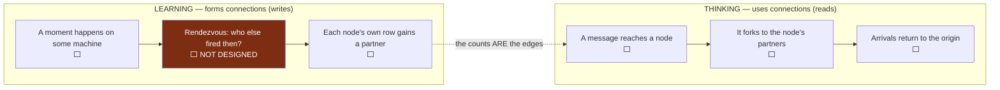
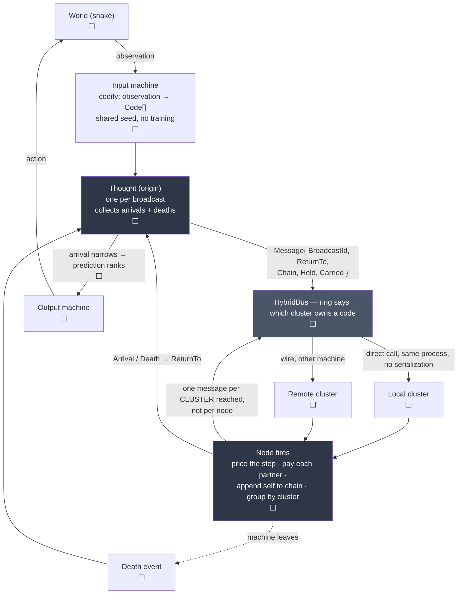

# Architecture

The living map. Updated as pieces land, so the shape is visible without
reading the code.

**Status marks: ✅ built ⬜ proposed, not written 🔬 experiment we want to run**

Nothing is built yet. Everything below is ⬜.

---

## The vocabulary

| Word | What it is |
|---|---|
| **Code** | A quantised fragment of one observation from one modality. Several codes fire for the same thing. **Never a concept** — a concept is what you reach by walking, and nobody holds one. |
| **Node** | One code, and its own row of counts. Holds edges, holds no address. |
| **Cluster** | A set of nodes. Holds an address. Fires exactly the node a message names. |
| **Machine** | Runs several clusters. The thing that joins and leaves the network. |
| **Message** | What crosses the bus. Two kinds — see below. |
| **Chain** | The nodes a message has walked, in order. The reasoning, carried. |

---

## Two kinds of traffic, and only one of them is designed

The Python has one process and one dictionary, so these are the same code path.
Distributed they are not, and conflating them is how the graph ends up with no
way to have been built.

**A connection is a count.** There is no edge object and no connect operation.
`_together[other]` going from absent to 1 *is* the connection forming. Nothing
decides that two nodes should be linked — decision 2, *every count, nothing
ever cut on the strength of a rule*.

### Two hashes, and they never meet

The easiest thing in this design to conflate. A time bucket is **not** a
cluster.

| | Hashed on | Answers | Lives for |
|---|---|---|---|
| **Time bucket** | the time window | who runs the rendezvous for this moment | one moment, then discarded |
| **Cluster** | the **code** | which machine holds this node, forever | the life of the network |

So **codes that fire together get connected to each other and then scatter**,
because placement is by *what a code is*, never by *when it arrived*. The
connection lives in the counts; the location lives in the ring. Independent.

**Nothing is assigned and nobody is told.** Every machine computes the owner of
a code independently from the code and the shared seed, and they all get the
same answer — decision 8, consistent hashing, no coordinator. A machine can
join a network it has never spoken to and route correctly immediately.

Buckets appear only on the learning path. The thinking loop never touches time.

---

## The thinking loop

**Wire cost is distinct clusters reached, not nodes reached.** A node forking
to 200 partners across 12 clusters sends 12 messages. Hops inside a cluster are
method calls.

**What stops everything firing is not clustering — it is the edge weight.** A
code present on every occasion has every other code as a partner. Scoring a
partner by *how well it predicts you* gives it near zero, because it predicts
nothing in particular. Measured: 0.0000 for the distractor, 0.9800 for the real
link. Clusters are transport; fan-out control is the weighting.

---

## What each piece knows about the whole

| Piece | Holds | Knows about the whole |
|---|---|---|
| `Node` | one `Code`, its own row of counts | nothing |
| `Cluster` | the nodes it owns, its address | nothing |
| `Machine` | its clusters, its bus peers | its own peers only |
| `Thought` | one broadcast's arrivals and accounting | one thought |

**C1 check.** No box waits for every other box. The shared seed is a constant
handed out once and frozen, which C1 permits.

---

## Open forks

Recorded here so a decision does not go quiet.

1. **How a node learns who it fired with.** The rendezvous above. `master` has
   a C1-legal answer — `buckets.Join`: observations land in short time buckets,
   a bucket owner is computed locally by hash, the owner notices the
   coincidence and tells each participant its partners, then the bucket is
   discarded. Measured at **exactly 1.0 messages per observation**. Undecided
   whether to take that shape.
2. **Who computes the edge weight.** `forward` strength is
   `together(here, other) / seen(other)` — the *partner's* marginal, which the
   sender cannot know. Either the receiver weighs (message carries `together`,
   receiver divides by its own marginal — C1-legal by construction, but then
   the sender cannot price a step before sending it), or marginals gossip and
   go stale.
3. **Cluster placement.** 🔬 Uniform hash gives balance and no coordinator, and
   guarantees that codes which always fire together live far apart. Hashing on
   the **top k bits of the code** puts similar codes together, since LSH codes
   near in Hamming distance share prefixes — locality with no coordinator, and
   columns falling out of the addressing. Limit: within-modality only, because
   two front ends never share a prefix. An arm, not a default.
4. **Pricing under `cost: best`** needs every partner weight before any send.
